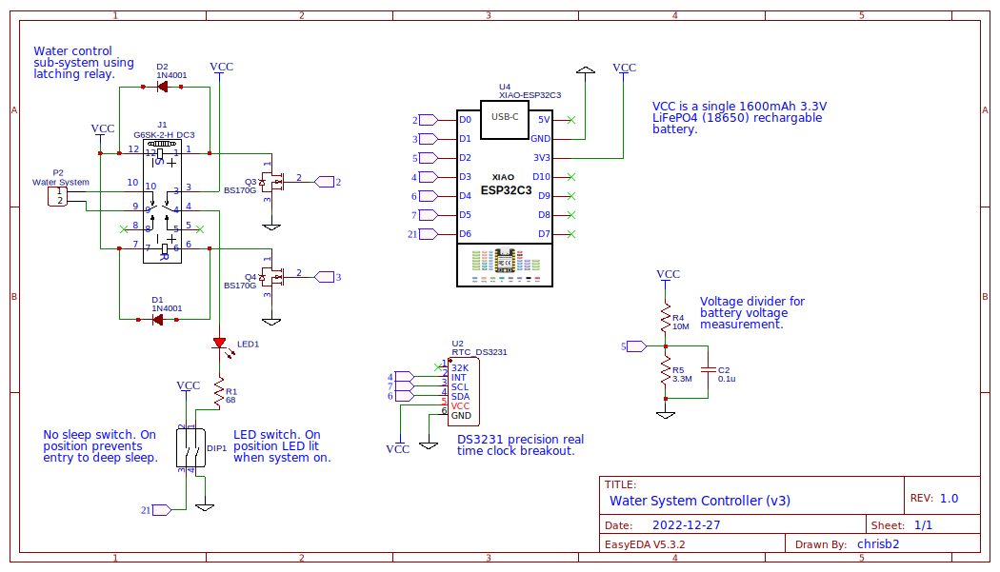

# Garden Watering System Controller

This [MicroPython](http://micropython.org/) project on an [ESP32](https://en.wikipedia.org/wiki/ESP32) uses
[Wunderground](https://www.wunderground.com) to determine if
significant rain has fallen in the last day, or is forecast today, and if so
disables the garden watering system to conserve water. It reports the rainfall
and system status to [ThingSpeak](https://thingspeak.com).

The project is run off a single 1600mAh LiFePO4 battery (18650) and uses the deep sleep mode of the ESP32 to
extend the battery life.

This controller is suitable for use with automatic watering system which expose
the ability to disable the system by making a connection open circuit.

## Schematic




## Usage

Configure a ThingSpeak channel something like:


Download the libraries:
* [urequests](https://raw.githubusercontent.com/micropython/micropython-lib/master/urequests/urequests.py) HTTP library.
* [urtc](https://raw.githubusercontent.com/chrisb2/Adafruit-uRTC/master/urtc.py) real time clock library.

Create a file called _secrets.py_ and fill in appropriate values:
```python
"""Secret values required to connect to services."""
WIFI_SSID = 'XXXXXX'
WIFI_PASSPHRASE = 'XXXXXX'
THINGSPEAK_API_KEY = 'XXXXXX'
WUNDERGROUND_API_KEY = 'XXXXXX'
WUNDERGROUND_STATION = '/NZ/christchurch'
WUNDERGROUND_LOCATION = 'zmw:00000.7.93781'
```
Copy all three files with the rest of the python files to the ESP32.
